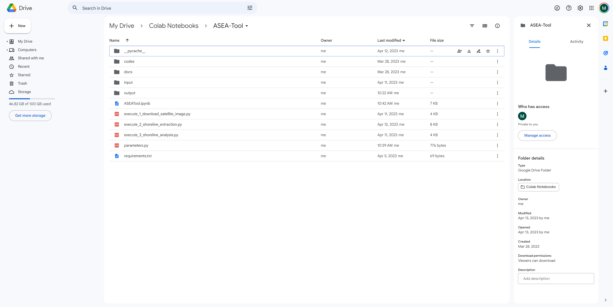
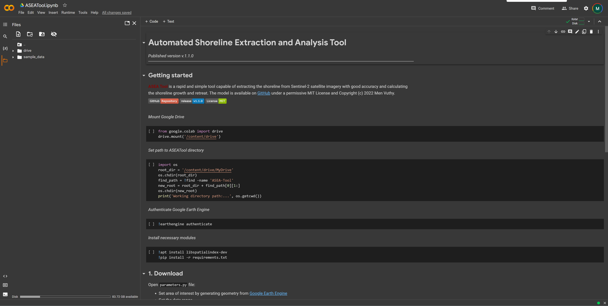
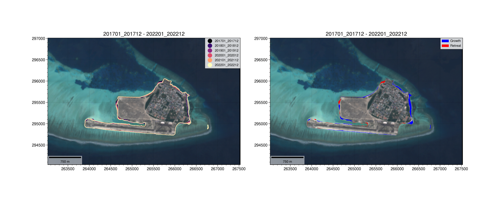

[](https://github.com/menvuthy/ASEA-Model/releases)
[](https://github.com/menvuthy/ASEA-Model/blob/main/LICENSE)

**Please put a Star :star: to support my repository! Thank you**

# ASEA-Tool

**Automated Shoreline Extraction and Analysis Tool** known as **ASEA Tool** is a rapid and
user-friendly tool capable of extracting the shoreline from Sentinel-2 satellite imagery at a
high accuracy and calculating the shoreline change between the past and present condition.
The tool is fully operated in a cloud platform connecting to Google Earth Engine
(GEE) so that the complicated environment setup is not necessary in local computer to utilize
this tool. By giving the target area and date range as input information, the model will
automatically collect all Sentinel-2 satellite images at the given area of interest (AOI) to 
calculate the median image, process them, and download the post-processed images directly
from GEE to user’s Google drive. From post-processed images, the tool analyzes the
sub-pixel values of Near-Infrared Band and classify them into land and water area by using
an unsupervised classification algorithm known as K-Means. The boundary dividing land
and water area is determined as preliminary shoreline, which basically has stair-like shape.
This boundary line is then converted to a smooth shoreline through shape-correction process in
the model. The shape-corrected shoreline is treated as the main shoreline for calculating
growth and retreat distance and rate per year between the past and present time based on transect
method. By using this tool, several kinds of output will be produced in various format ranging from images
in raster file (.tif) to shorelines in geojson file (.json). This tool enables coastal engineers and scientists 
to extract shorelines from open-source satellite images and explore shoreline changes at a regional scale 
with good accuracy, saving time, budget, and labor compared to manual extraction and high-cost image purchases.

<p float="left">
  
</p>

:blue_book: [Download User Manual](https://github.com/menvuthy/ASEA-Tool/blob/01b14247d6f6fee51acdc3530a5fef00425964c3/docs/user-manual.pdf)
 
## Requirement
To use ASEA tool, Google Colaboratory and Google Earth Engine are required to implement
the execution codes. GC and GEE are two completely different platforms. Google
Colab is a place where execution codes of ASEA tool are executed, while GEE is a place
where geometry of AOI is generated and also where all Sentinel satellite images are stored
and downloaded by the tool for analysis.

## Tool structure
ASEA is a tool developed using Python programming language and mainly operated in
Colab because Colab has many built-in modules and simple authorization workflow to connect
Google Earth Engine through Notebook Authenticator verification code which faciliates
the use of ASEA tool. It is highly recommended not to run in local computer or other cloud platforms besides Colab since 
the environment setup is different, and some modules might not work well in local environemnt.

## Usage

ASEA tool allows users to produce three main results of shoreline analysis through three executions (i.e. download, extraction, and analysis). The instruction on how to use ASEA model is described below:

The tool can be downloaded as zip file from this repository.
After unzipping the file, upload it to Google Drive by just dragging and dropping to any location as illustrated in below figure:

<p float="left">
  
</p>

Inside ASEA-Tool folder, there are multiple files and folders. To start the tool, double click on `ASEATool.ipynb` or right click on it and choose “Open with Google Colaboratory”. After that, the interface of ASEA tool in Colab will appear as shown in below figure:

<p float="left">
  
</p>

### Getting started

After opening ASEA tool in Colab, it requires connection to Google Drive to access files and store output. There are a number of way you can connect Colab to drive; however, the model here will do so by mounting Google drive in the runtime’s virtual machine.

Run the code below to mount drive:

```
from google.colab import drive
drive.mount('/content/drive')
```

Set working directory to ASEA-Tool directory by running the code below:

```
import os
root_dir = '/content/drive/MyDrive'
os.chdir(root_dir)
find_path = !find -name 'ASEA-Tool'
new_root = root_dir + find_path[0][1:]
os.chdir(new_root)
print('Working directory path:...', os.getcwd())
```

Run the code below to authenticate Google Earth Engine:

```
!earthengine authenticate
```

You will be provided with a URL to get verification code. Follow their instruction to copy the code and paste it in the given box and press Enter.

Install environment by running the code below:

```
!apt install libspatialindex-dev
!pip install -r requirements.txt
```

### 1. Download

Open `parameters.py` file:

- Set area of interest by generating geometry from [Google Earth Engine](https://code.earthengine.google.com)
- Set the date range

*Check `docs/generate-geometry.gif` to see the tutorial on how to generate geometry.*

Execute the code below to:

- Pre-process and download Landsat image from Google Earth Engine

```
!python execute_1_download_satellite_image.py
```

### 2. Extract shoreline

Execute the code below to:

- extract shorelines from retrieved satellite image
- create figure of satellite image and extracted shoreline

```
!python execute_2_shoreline_extraction.py
```

Tips: Before continue to next step, please check and confirm if the extracted shoreline is acceptable. If not, feel free to manually modify it in QGIS, then reupload to drive.

<p float="left">
  
</p>

### 3. Calculate growth and retreat

Go to `input/shoreline` folder

- place two shoreline json files (earlier shoreline and later shoreline) in the folder by maintaining the filenames

Execute the code below to:

- calculate shoreline growth and retreat
- create figure of shoreline growth and retreat

```
!python execute_3_shoreline_analysis.py
```

<p float="left">
  
</p>

## User manual

To learn more detail about this shoreline model, please read *User Manual* provided in `docs/user-manual.pdf`.

## License

ASEA-Tool is licensed under the [MIT License](https://github.com/menvuthy/ASEA-Tool/blob/01b14247d6f6fee51acdc3530a5fef00425964c3/LICENSE) and Copyright ©2022 Men Vuthy.


---
